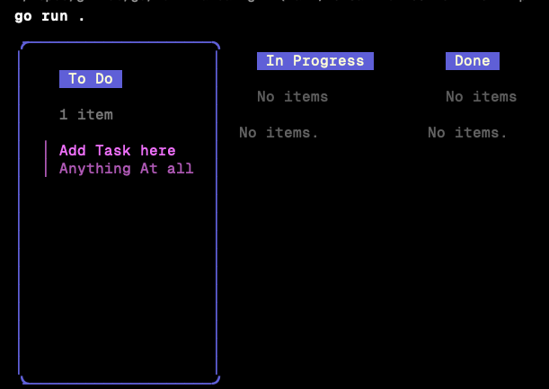

# Kanban CLI



# Installation 
Clone this repository  
```
git clone ...
```
Run 
```
cd term-kan
go mod init
go run .
```

# Usage
> Kanban page

| Keys | Event |
| -----| ------|
 "l"  or "right arrow"| Move to next column/board |
 "h" or "left arrow" | Move to previous column/board | 
 "n" | Add new task in the current board |
 "enter" | Move task to next board. e.g. todo -> inprogress, or done -> todo |
 "q" or "ctrl+c" | quit  |


